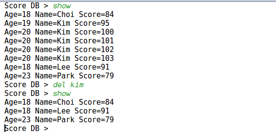

# week 3 코드 리뷰 20171583 김기범

# 코드 수정 목록

* 코드 리뷰 피드백 1 
	doScoreDB함수가 수행될때, 추가적인 단어가 들어오면 추가적인 단어를 무시함을 알리고 
	그 동작을 취하는게 사용자가 편리 할 것이다 라는 의견을 반영하여 코드를 수정했음
	(ex add kim 20 100 zz1125 가 입력되었을때zz1125를 무시하고 add kim 20 100을 인자로 받아들여 	doScoreDB함수 실행) 

* 코드 리뷰 피드백 2
	그 외에 예외처리가 미숙한 부분을 수정했음
	(inc에서 인자 값으로 정수가 아닌 다른것들이 들어왔을때 예외처리를 했음)

* del 수정
	doSocreDB에서 del이 수업에서 의도하는 수행을 하지않았던 점을 해결했음

# 코드 리뷰 피드백 1

위 코드 처럼 parse의 길이가 4이상일때, 4보다 크면 
추가적인 단어는 무시함을 알리고 동작을 수행하도록 했음
만약 필요한 단어갯수보다 단어가 적을때는
원래했던 예외처리로 대체함 
이렇게 add find show del inc의 코드를 수정

# 코드 리뷰 피드백 2

Inc의 경우 두번째 단어는 정수타입이 되어야 정상적으로 작동함
고로 만약 두번째 단어가 정수 이외의 타입의(ex :str, float)이 들어왔을때
ValueError 예외처리를 해줌 add의 부분은 위와같은 예외처리를 해뒀으나 
Inc 부분에서 이 부분의 예외처리를 빠트려 리뷰 시간에 피드백을 받아 수정했음 

# del 코드 수정 

55 : 빈 리스트를 생성
56 : parse의 길이가 2 이상일때 참인 조건문
57, 58 : 만약 추가적인 단어가 들어왔을때 그 단어를 무시함을 알리는 조건문
59 : scdb 리스트의 요소를 하나하나 순환하는 반복문 
60 : parse의 두번째 단어 (데이터베이스에서 지울 이름)의 첫글자를 대문자로 변환

61 : 입력받은 두번째 단어가 scdb의 요소(P 이때 이 요소는 딕셔너리임 )의 Name의 value값과 같다면 
     실행하는 조건문
62 : scdb의 요소(p)의 인덱스 값을 rm에 할당
63 : 55줄에서 만든 빈 리스트에 rm값을 추가 
64 : scdb rm번째 요소를 del
65 : del 한 인덱스 자리에 그 인덱스 값을 대신 넣어줌 예를들어 2번째 인덱스값의 딕셔너리가 삭제되었을때
     그 삭제된 딕셔너리 대신 2를 넣어줌(scdb의 리스트 요소들의 전체적인  인덱스 값이 변하는걸 방지)
66, 67: scdb리스트 요소에 들어간 인덱스값을 remove

Name이 Kim인 데이터를 문제없이 모두 삭제했음

